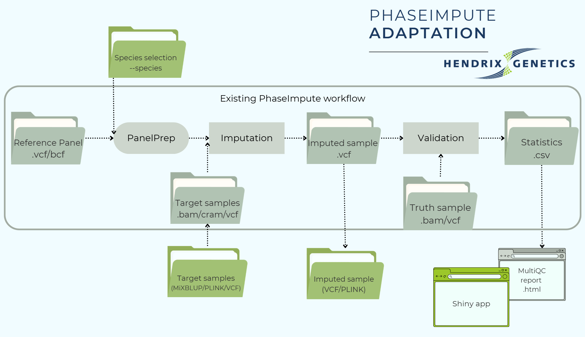

<h1>
  <picture>
    <source media="(prefers-color-scheme: dark)" srcset="docs/images/logo/nf-core-phaseimpute_logo_dark.png">
    
  </picture>
</h1>

**Hendrix Genetics Fork - Livestock Imputation Pipeline**


[](https://doi.org/10.5281/zenodo.14329225)
[](https://www.nf-test.com)[](https://www.nextflow.io/)
[](https://github.com/nf-core/tools/releases/tag/3.5.1) 
[](https://www.docker.com/)
[](https://sylabs.io/docs/)
[](https://cloud.seqera.io/launch?pipeline=https://github.com/nf-core/phaseimpute)
[](https://nfcore.slack.com/channels/phaseimpute)
[](https://bsky.app/profile/nf-co.re)
[](https://mstdn.science/@nf_core)

## What This Pipeline Does

This pipeline **imputes missing genotypes** in your target samples using a reference panel. It is optimized for Hendrix livestock species with pre-tuned parameters for each. Reference genomes are automatically downloaded and cached on first use.

**For more detailed usage explanations, please visit [nf-co.re/phaseimpute](https://nf-co.re/phaseimpute/).**

<picture>
  
</picture>


## Supported Species

| Species | `--species` | `--genome` | With chr prefix |
|---------|-------------|------------|-----------------|
| Layer chicken | `layer` | `GRCg7b` | `GRCg7b_chr` |
| Broiler chicken | `broiler` | `GRCg7b` | `GRCg7b_chr` |
| Turkey | `turkey` | `Turkey_5.1` | `Turkey_5.1_chr` |
| Pig | `pig` | `Sscrofa11.1` | `Sscrofa11.1_chr` |
| Atlantic salmon | `salmon` | `Ssal_v3.1` | `Ssal_v3.1_chr` |
| Rainbow trout | `trout` | `USDA_OmykA_1.1` | `USDA_OmykA_1.1_chr` |
| Pacific white shrimp | `shrimp` | `ASM378908v1` | *(scaffold-level only)* |

For other species a separate `fasta` needs to be downloaded, or check if it is available in `conf/igenomes.config`.

> **Note:** Use the `_chr` variant if your VCF files use `chr1, chr2...` chromosome naming. Use the base version if they use `1, 2...` naming.

## Input Formats

The pipeline accepts several input formats:

| Format | Use case | CSV input columns |
|--------|----------|----------|
| **BAM/CRAM** | Aligned sequencing reads (most common for low-pass data) | sample,file,index |
| **VCF** | Pre-called genotypes from arrays or sequencing | sample,file,index |
| **PLINK → VCF** | Convert PLINK binary files to VCF using included tools | sample,bed,bim,fam / sample,ped,map |
| **MiXBLUP → PLINK → VCF** | Convert MiXBLUP output via PLINK to VCF | sample,gtp,ped,manifest |

## Quick Start

### Step 1: Prepare your input samplesheet

Create `target.csv` with your target samples (to be imputed) in any of the above mentioned formats:

```csv
sample,file,index
ANIMAL_1,/path/to/sample.vcf.gz,/path/to/sample.vcf.gz.csi
ANIMAL_2,/path/to/sample2.vcf.gz,/path/to/sample2.vcf.gz.csi
...
```

If you have one file with all samples, that is also possible, just put them on one line:

```csv
sample,file,index
ALL_SAMPLES,/path/to/sample.vcf.gz,/path/to/sample.vcf.gz.csi
```

### Step 2: Prepare your panel samplesheet

Create `panel.csv` with your reference panel (one row per chromosome):

(If all chromosomes are in one file, just put that same file on every line)

```csv
panel,chr,vcf,index
MyPanel,chr1,/path/to/panel_chr1.vcf.gz,/path/to/panel_chr1.vcf.gz.csi
MyPanel,chr2,/path/to/panel_chr2.vcf.gz,/path/to/panel_chr2.vcf.gz.csi
```
### Optional: Prepare your truth samplesheet (Validation step)

Create `truth.csv` with your truth dataset (for validation), same format as target.csv.

```csv
sample,file,index
TRUTH,/path/to/truth.vcf.gz,/path/to/truth.vcf.gz.csi
```

### Step 3: Run the pipeline

```bash
nextflow run /path/to/phaseimpute \
  --species pig \
  --genome Sscrofa11.1 \
  --input target.csv \
  --panel panel.csv \
  --steps panelprep,impute \
  --tools beagle5 \
  --outdir pig_impute/output \
  -profile slurm
```

add `-resume` after debugging, cached processes will be reused.

## Key Parameters

### Required

| Parameter | Description |
|-----------|-------------|
| `--species` | Hendrix species name - sets optimized imputation parameters |
| `--genome` | Reference genome assembly - auto-downloads if not cached |
| `--input` | Path to samplesheet with target samples to impute |
| `--panel` | Path to samplesheet with reference panel VCFs |
| `--outdir` | Directory where results will be saved |
| `-profile` | Profile to be used. For HPC use: slurm. For Azure use: azure. |

### Resource Allocation

The pipeline automatically allocates resources based on species (for genome/panel size) and sample count. Use `--sample_scale` to match your target sample count:

| `--sample_scale` | Target samples | Use case |
|------------------|----------------|----------|
| `low` | < 500 | Small studies, testing |
| `medium` (default) | 500 - 2000 | Typical production runs |
| `high` | > 2000 | Large production runs (5000+ samples can take 5+ days for splitting) |

**Example for large pig run with 4000 samples:**
```bash
nextflow run /path/to/phaseimpute \
  --species pig \
  --sample_scale high \
  --genome Sscrofa11.1 \
  --input target.csv \
  --panel panel.csv \
  --steps impute \
  --tools beagle5 \
  --outdir results \
  -profile slurm
```

> **Note:** Species configs handle panel-size-dependent resources automatically (e.g., pig ~65M variants gets higher memory than chicken ~11M). The `--sample_scale` parameter handles sample-count-dependent processes like `BCFTOOLS_PLUGINSPLIT` which scales dramatically with sample count.

**Skip splitting for faster runs:** If you don't need per-sample VCF files or per-sample stats, you can skip the expensive `BCFTOOLS_PLUGINSPLIT` step entirely:

```bash
--split_imputed false
```

This can save days of runtime for large datasets (5000+ samples). The concatenated multi-sample VCF will still be produced.


### Pipeline Steps

| Parameter | Description |
|-----------|-------------|
| `--steps panelprep` | Prepare and phase the reference panel (run once per panel) |
| `--steps impute` | Impute genotypes in your target samples |
| `--steps validate` | Compare imputed vs truth data for accuracy metrics |
| `--steps panelprep,impute,validate` | Run multiple steps in one command |

### --steps panelprep

**Panel Preparation**: Prepares the reference panel through phasing, quality control, variant filtering, and annotation. Key processes include:
   - **Normalization** of the reference panel to retain essential variants.
   - **Phasing** of haplotypes in the reference panel using [Shapeit5](https://odelaneau.github.io/shapeit5/).
   - **Chunking** of the reference panel into specific regions across chromosomes.
   - **Position Extraction** for targeted imputation sites.

| Parameter | Default | Description |
|-----------|---------|-------------|
| `--phase` | `true` | Should the reference panel be phased  |
| `--normalize` | `true` | Should the reference panel be normalized |
| `--compute_freq` | `true` | Should the allele frequency for each variant (AC/AN fields necessary for the validation step) be computed |

### --steps impute

**Imputation (`--impute`)**: This is the primary step, where genotypes in the target dataset are imputed using the prepared reference panel. The main steps are:
   - **Imputation** of the target dataset using tools like [Glimpse1](https://odelaneau.github.io/GLIMPSE/glimpse1/index.html), [Glimpse2](https://odelaneau.github.io/GLIMPSE/), [Stitch](https://github.com/rwdavies/stitch), [Quilt](https://github.com/rwdavies/QUILT), [Beagle5](https://faculty.washington.edu/browning/beagle/beagle.html) or [Minimac4](https://github.com/statgen/Minimac4).
   - **Ligation** of imputed chunks to produce a final VCF file per sample, with all chromosomes unified.

| Parameter | Default | Description |
|-----------|---------|-------------|
| `--batch_size` | `100` | Maximal number of individuals per batch for imputation  |
| `--chunks` |  | Path to comma or tab-separated file, yaml or json file containing genomic chunks to be used for imputation. Is also created by panelprep step and automatically used if necessary |
| `--posfile` |  | Path to comma or tab-separated file, yaml or json file containing reference panel information converted files for imputation. Is also created by panelprep step and automatically used if necessary |
| `--conformgt` | `true` | Enable genotype harmonization using conform-gt to align target alleles to reference panel  |


### Imputation Tools

| Parameter | Description |
|-----------|-------------|
| `--tools beagle5` | Beagle 5.2 - Best choice for livestock |
| `--tools glimpse2` | Fast and accurate for most use cases |
| `--tools glimpse1` | Original GLIMPSE algorithm |
| `--tools minimac4` | Minimac4 - widely used in human genetics |
| `--tools stitch` | For low-coverage data without a reference panel |
| `--tools quilt` | Similar to STITCH, uses haplotype reference |

### --steps validate

**Validation (`--validate`)**: Assesses imputation accuracy by comparing the imputed dataset to a truth dataset. This step leverages the [Glimpse2](https://odelaneau.github.io/GLIMPSE/) concordance process to summarize differences between two VCF files.

| Parameter | Default | Description |
|-----------|---------|-------------|
| `--input_truth` |  | Path to comma or tab-separated file, yaml or json file containing samples truth files informations. See specifications above  |
| `--bins` | `0 0.01 0.02 0.05 0.1 0.2 0.3 0.4 0.5` | User-defined allele count bins used for rsquared computations |
| `--min_val_gl` | `0.9` | Minimum genotype likelihood probability P(G|R) in validation data. Set to zero to have no filter, if using gt-validation |
| `--min_val_dp` | `5` | Minimum coverage in validation data. If FORMAT/DP is missing and -min_val_dp > 0, the program exits with an error. Set to zero to have no filter of if using –gt-validation  |
| `--gt_val` | `false` | Use genotype-based validation instead of genotype likelihoods. Required for compatibility with FreeBayes-style GL fields.  |


## Outputs

| Output | Location | Contains |
|--------|----------|----------|
| Imputed data | `outdir/imputation/<tool>/vcf/` | Concatenated plink/vcf and per sample vcf. |
| MultiQC report | `outdir/multiqc/multiqc_report.html` | General accuracy metrics |
| Pipeline info | `outdir/pipeline_info/` | CPU/Mem usage per process (trace), co2 footprint, execution metrics. |

**QC Dashboard**: Launch the interactive Shiny app with `shiny_qc_app/launch_app.sh` to explore imputation quality metrics. For more info read `shiny_qc_app/README.md`.

## More Information

- **Samplesheet formats**: See [docs/usage.md](docs/usage.md) for detailed input specifications
- **Species parameters**: See [conf/species/species_config_summary.md](conf/species/species_config_summary.md) for species-specific settings
- **Advanced options**: See [nf-core/phaseimpute documentation](https://nf-co.re/phaseimpute) for all parameters

## Credits

**Original pipeline**: [nf-core/phaseimpute](https://github.com/nf-core/phaseimpute) by Louis Le Nezet & Anabella Trigila

**Hendrix Genetics adaptations**: Anja Burghgraef - added livestock species support, automatic genome downloads, ConformGT harmonization, and QC dashboard.

If you use this pipeline, please cite: [10.5281/zenodo.14329225](https://doi.org/10.5281/zenodo.14329225)
